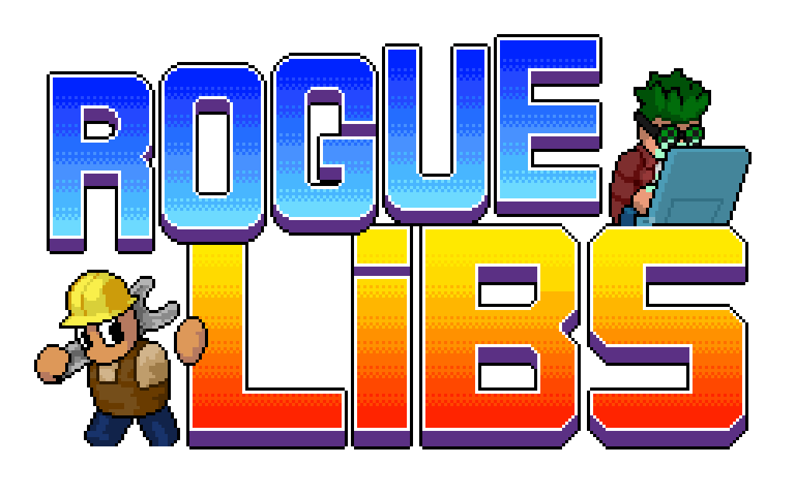

  

    
  

  

    
    
     
    
    
    
  

This modding library does nothing on its own, but it provides methods for other mods to easily create new custom mutators, items, abilities and traits.

If you have any suggestions or find any bugs, you can open a new issue here on GitHub, or create a pull request:

  
  

## Installation ##

1. Install BepInEx
   1. [Download the latest version of BepInEx](https://github.com/BepInEx/BepInEx/releases/latest);
   2. Drag all files from the archive into directory `/Steam/SteamApps/common/Streets of Rogue`;
   3. Run the game, so BepInEx can create needed files and directories, and close the game;
2. Install RogueLibs
   1. [Download the latest version of RogueLibs](https://github.com/Abbysssal/RogueLibs/releases/latest);
   2. Drag the file "RogueLibsCore.dll" into directory `/Steam/SteamApps/common/Streets of Rogue/BepInEx/plugins`;
   3. Drag the file "RogueLibsPatcher.dll" into directory `/Steam/SteamApps/common/Streets of Rogue/BepInEx/patchers`;
3. Download and install whatever mods you want to use.
4. Run the game!

## Table of Contents ##

- **Main page**
- **1. Introduction**
  - 1.1. [Basic Setup](./md/1.1-Basic-Setup.md)
  - 1.2. [Patching and Utilities](./md/1.2-Patching-and-Utilities.md)
  - 1.3. [Classes](./md/1.3-Classes.md)
- **2. Custom Items and Abilities**
  - 2.1. [Custom Items](./md/2.1-Custom-Items.md)
  - 2.2. [Adding Functionality](./md/2.2-Adding-Functionality.md)
  - 2.3. Making Weapons
  - 2.4. [Inventory and Events](./md/2.4-Inventory-and-Events.md)
  - 2.5. Custom Abilities
- **3. Custom Traits and Status Effects**
  - 3.1. [Custom Traits](./md/3.1-Custom-Traits.md)
  - 3.2. [Custom Status Effects](./md/3.2-Custom-Status-Effects.md)
- **4. Custom Unlocks and Mutators**
  - 4.1. Custom Unlocks
  - 4.2. Custom Mutators
  - 4.3. Custom State Unlocks
- **5. Custom Objects**
  - 5.1. ???
- **6. Custom Agents**
  - 6.1. ???
- **7. Advanced**
  - 7.1. [Hook System](./md/7.1-Hook-System.md)
  - 7.2. Unlocks and Menus

## Links ##
- [Download RogueLibs (latest stable version)](https://github.com/Abbysssal/RogueLibs/releases/latest)
- [Steam guide on modding with BepInEx](https://steamcommunity.com/sharedfiles/filedetails/?id=2106187116)