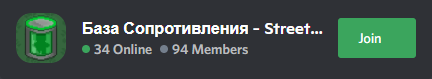

  

    
  

  

    
    
     
    
    
    
  

This modding library does nothing on its own, but it provides methods for other mods to easily create new custom mutators, items, abilities and traits.

If you have any suggestions or find any bugs, you can open a new issue here on GitHub, or create a pull request if you know how to fix that:

  
  

## Contents ##

- **Main page**
- [1. Getting started](./md/1.%20Getting%20started.md)
- 2\. Adding custom content
  - [2.1. Custom Names](./md/2.1.%20Custom%20Names.md)
  - [2.2. Custom Unlocks](./md/2.2.%20Custom%20Unlocks.md)
  - [2.3. Custom Mutators](./md/2.3.%20Custom%20Mutators.md)
  - [2.4. Custom Items](./md/2.4.%20Custom%20Items.md)
  - [2.5. Custom Abilities](./md/2.5.%20Custom%20Abilities.md)
  - [2.6. Custom Traits](./md/2.6.%20Custom%20Traits.md)
- 3\. Additional tools
  - [3.1. RoguePatcher](./md/3.1.%20RoguePatcher.md)
  - [3.2. RogueUtilities](./md/3.2.%20RogueUtilities.md)
- [4. Changelog](./md/4.%20Changelog.md)

## Links ##
- [Download RogueLibs (latest stable version)](https://github.com/Abbysssal/RogueLibs/releases/latest)
- [Steam guide on modding with BepInEx](https://steamcommunity.com/sharedfiles/filedetails/?id=2106187116)

## Discord ##

  <h4>Official Streets of Rogue Discord Server</h4>
  
  <h4>Русский сервер Дискорд по Streets of Rogue (russian Discord server)</h4>
  

