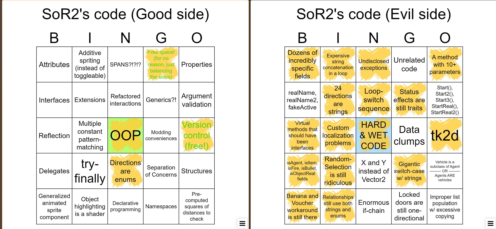

# Advice to SoR2 modders

I am writing this under an appreciable mental strain, since by tonight I shall be modding no more. If&nbsp;you're interested in modding Streets of Rogue 2, then I suggest you read this short story, that I believe accurately represents what an experience modding this game will be...

<!-- truncate -->

## Product of a twisted mind

At a first glance, SoR1 may appear as just the first project of an unexperienced developer. All of the mistakes Matt made were understandable, forgiveable, *negligible*. When I first started modding the game, I didn't even realize that they were bad, since I had no C# knowledge at the time. But in just a few months I learned that they *weren't normal*, they were *abhorrent abominations*, commonly brought to life by beginner developers. I had thought that it was so *uncannily weird* that Matt, a developer with many years of experience, left so many in his code. He himself had admitted that the code was bad, and said he planned to fix everything in preparation for SoR2, so I didn't think much of it. *Oh, how was I wrong...*

No one could comprehend the entirety of SoR1's code, and very few have been able to modify just a small part of it. *I was one of the lucky most successful few*, with a library and many mods under my belt. I've seen many modders come and go, — they'd ask about getting into modding... But after directing them to dnSpy, I'd never hear from them again. SoR2 is even worse. I knew better than to expect much from Matt, but I *did* have some bare minimum expectations, — *I expected some improvements*.

**I was naive...** I didn't think it could get much worse than it already was. I was not prepared for the reserve of unguessed horrors, that Matt would let loose upon the world with the demo.

## Descent into madness

It's straight up **Cthulhuesque-adjacent**. I feel like a character in one of H.P. Lovecraft's stories, that peered into the unknown too much and went insane... It damaged my sanity, and now I find myself here, rambling about the horrors I've had the unfortune to witness. But unlike true cosmic horror, I could comprehend everything I saw. I don't think I'll ever be able to look at bad code the same way again.

The code... It simply cannot be described — there is no language for such abysms of shrieking and immemorial lunacy, such eldritch contradictions of principles, patterns and underlying logic. The stars were right again, and what a decades-old walk of life had failed to produce by design, a foolish inexperienced programmer had done by accident.

The labyrinthine execution paths twist and warp in cunning spirals that I dare not seek to interpret. The&nbsp;bizzare perversions of the familiar and the monstrous, horribly remote and distinct from programming as we know it. I **never ever** want to see that codebase again.

## If you are...

#### ... a developer with ANY degree of experience (3+ months)
Give up on trying to mod SoR2. After working for so long with code of tolerable quality, you won't be able to get into modding SoR2, — its code is *just that horrible*. And by "tolerable quality" I mean the **baseline lowest**, the kind that money-hungry and uncaring corporations have devs work on, with no time to refactor or even fix anything. The kind of code that you hear of in anecdotes, and see in DailyWTF posts, — **that** is what I mean by "code of tolerable quality"! I'd much rather work on these almost mythical failures of the programming world, than attempt modding SoR2! You've got enough experience to make a decision yourself, so I'll leave the final judgement to you. Choose wisely.

#### If you are... a beginner developer (0-2 months)
Go ahead! Try modding it. Your sanity won't be damaged as much, as you don't yet know what good and bad code is. You may succeed at a few things, but you'll get to learn programming from the worst code in the world, so I'm unsure if you'll want to continue on this harrowing path. As you learn how to actually write code, you'll begin to understand just what kind of horrible pit you've put yourself into... Forsake the people idolizing you for your endeavors. No one will blame you for quitting.

 
 
 

## Final epigram

 

Heed my fable. Don't repeat my mistakes.

You may think that I'm being irrational.

But just try modding the game.

*You'll see what I saw.*

 
 
 
 
 
 

<small style={{ opacity: 0.5 }}>Was this all satirical? Unironically, only in part.</small>

